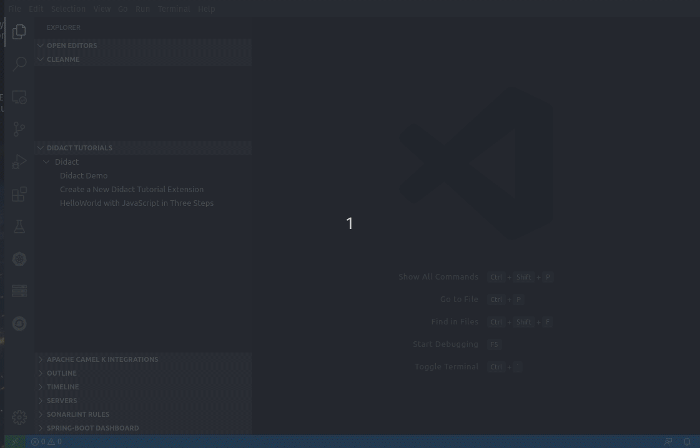
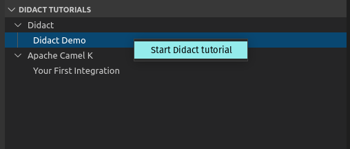
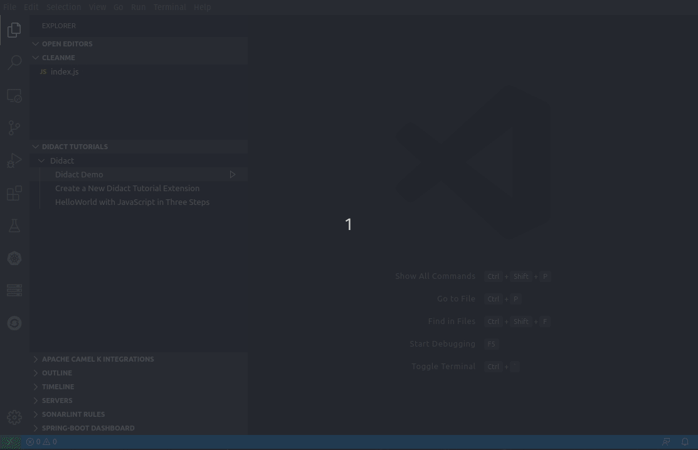
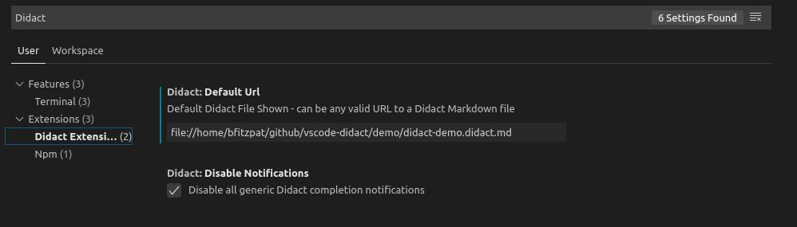

# vscode-didact README  

The **vscode-didact** extension does a few things, but mainly it shows what's possible through a combination of a simple Markdown or AsciiDoc file, the VS Code Webview, and calling easily accessible commands in VS Code.

For a demo file of what functionality is currently available, check out [the didact-demo.](vscode://redhat.vscode-didact?https=raw.githubusercontent.com/redhat-developer/vscode-didact/master/demos/markdown/didact-demo.didact.md)

## VSCode-Didact In Action

We have created a tutorial that walks through creating a simple Hello World in JavaScript. This tutorial, though simple, shows several of Didact's features in action, including:

* Using a Didact command to test to see if Node is available in the user's system.
* Using a Didact command to create a file in the user workspace.
* Using a built-in command from VS Code to open the file we create in the user workspace.
* Using Didact commands to not only open a named terminal window, but call a command in that same window at the command line.

You can find the source for the HelloJS tutorial in [this MarkDown file](./demos/markdown/helloJS/helloJS.didact.md).

## Accessing Didact in the workspace. 

With Didact installed, there are three ways to open a Didact window.

* To access Didact, access the Command Palette (`View->Command Palette`, `Ctrl+Shift+P`, or `F1`) and type **Didact**. Select `Open Didact` and it will open with the default Didact file specified in the Settings.
* To open a local Didact file in the workspace directly, Right-click on the Didact file (`*.didact.md` or `*.didact.adoc`) and select **Start Didact Tutorial from File** from the context menu.

In addition, you now have the `Didact Tutorials` view. 

If you right-click on a tutorial (such as "Didact Demo"), you see a `Start Didact Tutorial` menu, which opens the Didact window or changes the current Didact window to the selected tutorial. These entries are provided by registering new tutorial name/tutorial uri/category combinations with Didact's tutorial registry.

*NEW!* You can also simply mouse over a registered tutorial and hit the 'play' button (triangle) to launch it in the Didact window.

## Didact Settings 

To change the default Didact file, access the settings (`File->Preferences->Settings`), type **Didact** and set the `Didact: Default Url`. This can be any valid URL to a Didact formatted Markdown file, including `http://`, `https://`, or `file://` URLs.

To turn on generic Didact completion notifications (off by default), access the settings (`File->Preferences->Settings`), type **Didact** and set the `Didact: Disable Notifications` checkbox. If unchecked, additional notifications will occur when Didact actions are activated in the IDE.

To have Didact open a window with the default Didact file on startup, access the settings (`File->Preferences->Settings`), type **Didact** and set the `Didact: Open Default Tutorial At Startup` checkbox.

## Auto-complete for Didact in Markdown files

To help you set up Didact tutorials, we've added a number of auto-completions (accessible by pressing `Ctrl+Space` while editing a Markdown file) to provide most of the basic things you'll need.

Included completions:

* Insert Validate All button
* Insert Requirements label
* Insert link to install required VS Code extension
* Insert link to create temporary folder as WS root
* Insert link to start didact from File in Extension folder
* Start a new didact link (inserts `didact://?` and then offers additional completions

From a `didact://?` start, you also get:

* Start terminal with name
* Send named terminal some text
* Send named terminal a Ctrl+C
* Close terminal with name
* Non-didact command
* Check CLI for some returned text
* Check CLI for some success (no text)
* Check for required extension
* Check for root folder in the WS
* Scaffold project
* Start Didact from Currently Selected File

## A Note about Auto-complete for Didact in AsciiDoc files

This functionality requires an AsciiDoc extension to be installed in your Workspace. We have seem intermittent issues with these extensions, including this [popular AsciiDoc extension.](vscode:extension/joaompinto.asciidoctor-vscode). We have noticed that the Didact extension does not always start when this extension is installed.

When it works, we should have access to the following completions.

Outside a didact link, you get:

* Start a new didact link (inserts `didact://?` and then offers additional completions
* Insert Link to Start Didact from File in Extension folder
* Insert Link to Install Required VS Code extension

From a `didact://?` start, you get:

* Start terminal with name
* Send named terminal some text
* Send named terminal a Ctrl+C
* Close terminal with name
* Non-didact command
* Check CLI for some returned text
* Check CLI for some success (no text)
* Check for required extension
* Check for root folder in the WS
* Scaffold project
* Start Didact from Currently Selected File
* Validate All Didact Requirements
* Add Temporary Folder as WS Root

## Additional Details

Check out the Wiki pages [here](https://github.com/redhat-developer/vscode-didact/wiki/Welcome-to-Didact!) for details about how to use Didact, write your first tutorial, format links, and much more. 

For a list of available commands, check out the [Command Reference](examples/commands.reference.md).

## Ideas or want to contribute?

Check out [the project on Github](https://github.com/redhat-developer/vscode-didact)! 

[The readme](https://github.com/redhat-developer/vscode-didact/blob/master/README.md) has a ton of information about some of the specifics for link formatting, project json format, etc. 

And feel free to [add issues, submit feature requests, log bugs, etc](https://github.com/redhat-developer/vscode-didact/issues)!

**Enjoy!**
