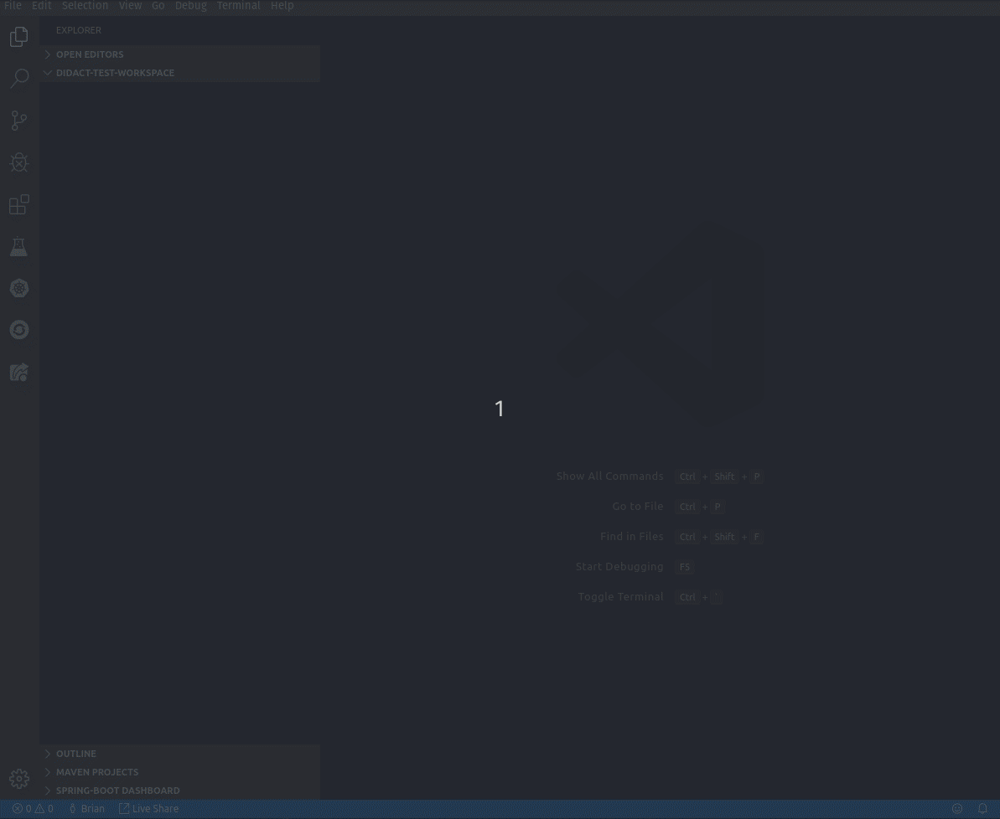

# vscode-didact README  

The **vscode-didact** extension does a few things, but mainly it shows what's possible through a combination of a simple Markdown or AsciiDoc file, the VS Code Webview, and calling easily accessible commands in VS Code.

For a demo file of what functionality is currently available, check out [the didact-demo.](vscode://redhat.vscode-didact?https=raw.githubusercontent.com/bfitzpat/vscode-didact/master/demo/didact-demo.didact.md)

## VSCode-Didact In Action

What follows is a simple example with three actions. One scaffolds a project based on a structure defined in JSON. One opens a file created when the folder structure was created. And one triggers a command in a different extension if it's installed. The tutorial is defined in [this MarkDown file](./example/tutorial2.didact.md)

## Accessing Didact in the workspace. 

With Didact installed, there are three ways to open a Didact window.

* To access Didact, access the Command Palette (`View->Command Palette`, `Ctrl+Shift+P`, or `F1`) and type **Didact**. Select `Open Didact` and it will open with the default Didact Markdown file specified in the Settings.
* To open a local Didact file in the workspace directly, Right-click on the Didact Markdown file (`*.didact.md` or `*.didact.adoc`) and select **Start Didact Tutorial from File** from the context menu.

In addition, you now have the `Didact Tutorials` view. 

If you right-click on a tutorial (such as "Didact Demo"), you see a `Start Didact Tutorial` menu, which opens the Didact window or changes the current Didact window to the selected tutorial. These entries are provided by registering new tutorial name/tutorial uri/category combinations with Didact's tutorial registry.

## Didact Settings 

To change the default Didact file, access the settings (`File->Preferences->Settings`), type **Didact** and set the `Didact: Default Url`. This can be any valid URL to a Didact formatted Markdown file, including `http://`, `https://`, or `file://` URLs.

To turn on generic Didact completion notifications (off by default), access the settings (`File->Preferences->Settings`), type **Didact** and set the `Didact: Disable Notifications` checkbox. If unchecked, additional notifications will occur when Didact actions are activated in the IDE.

## Auto-complete for Didact in Markdown files

To help you set up Didact tutorials, we've added a number of auto-completions (accessible by pressing `Ctrl+Space` while editing a Markdown file) to provide most of the basic things you'll need.

Included completions:

* Insert Validate All button
* Insert Requirements label
* Insert link to install required VS Code extension
* Insert link to create temporary folder as WS root
* Insert link to start didact from File in Extension folder
* Start a new didact link (inserts `didact://?` and then offers additional completions

From a `didact://?` start, you also get:

* Start terminal with name
* Send named terminal some text
* Send named terminal a Ctrl+C
* Close terminal with name
* Non-didact command
* Check CLI for some returned text
* Check CLI for some success (no text)
* Check for required extension
* Check for root folder in the WS
* Scaffold project
* Start Didact from Currently Selected File

## Additional Details

Check out the Wiki pages [here](https://github.com/redhat-developer/vscode-didact/wiki/Welcome-to-Didact!) for details about how to use Didact, write your first tutorial, format links, and much more. 

For a list of available commands, check out the [Command Reference](examples/commands.reference.md).

# Next steps

1. Find the best way to ensure that files (project.json, commands referencing files in a project scaffolded by a project.json) are accessible across extensions (i.e. if I register a tutorial in Camel K, the Didact extension should be ok with finding all the available commands and any files)
2. Look into finding ways to chain commands together so that you can do things like create a project and open a file all in one go.
3. Look at the Eclipse Cheat sheet approach to see if we can glean anything - http://help.eclipse.org/kepler/index.jsp?topic=%2Forg.eclipse.platform.doc.isv%2Freference%2Fextension-points%2FcheatSheetContentFileSpec.html 
4. Also look at the Integr8ly Walkthroughs to see if we can glean anything - https://github.com/integr8ly/tutorial-web-app-walkthroughs/tree/master/walkthroughs
5. Figure out a way to limit the `Start Didact Tutorial from File` context menu to only work for Didact files.
6. Figure out a way to limit the `Didact Scaffold Project from File` context menu to only work for Didact Project Scaffolding files.

**Enjoy!**
