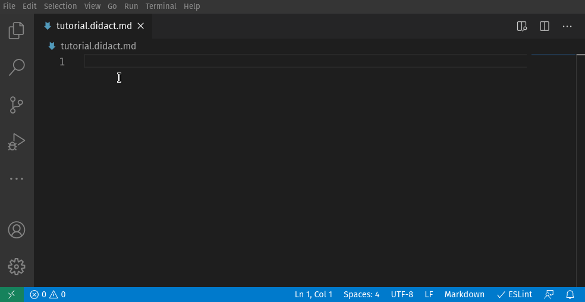
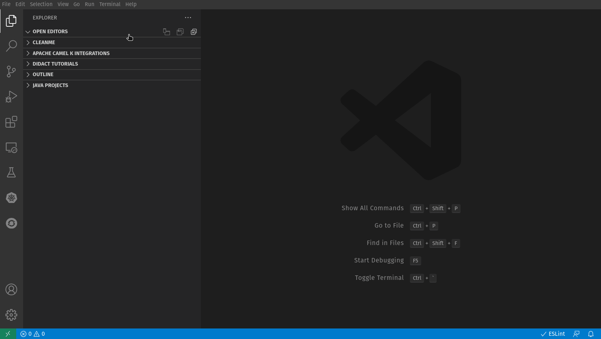

  

 

<h1 align="center">Didact</h1> 
<h2 align="center">Easy interactive tutorials for VS Code.</h2> 

The <b>Didact</b> framework is designed to instruct users in a useful way regarding how to complete tasks through a combination of text (Markdown- or AsciiDoc-formatted), images, and active links that show VS Code functionality in action. Those links are paired with VS Code’s simple command framework to interact with the IDE directly -- and that provides one-click access to nearly all the functionality VS Code and its extensions have to offer.
 

 

 

# Didact offers two avenues to success

1. Published tutorials that walk users through easy-to-follow tutorials to accomplish their goals in an interactive manner.
2. Developer tools to make writing and publishing such tutorials an easy process.

## Starting the JavaScript Didact Tutorial

1. Open the `Didact Tutorials` view in the Explorer activity sidebar.
2. Expand the tree and find `HelloWorld with JavaScript in Three Steps`.
3. Click the triangle at the end of the line or select `Start Didact tutorial` from the right-click menu.
4. When the tutorial opens, work through the various steps.

## Writing your first Didact tutorial

1. Create a new Markdown or AsciiDoc file with the extension `.didact.md` or `.didact.adoc`.
2. Write some text about the action your user will accomplish. 
3. Start a new Didact link:
* In Markdown, type `[Open a new terminal]()`, put the cursor between the parentheses `()` and press `Ctrl+Space`. 
* In AsciiDoc, type `link:[Open a new terminal]`, put the cursor after `link:`, and press `Ctrl+Space`.
4. Select `Start new Didact command link`.
5. Choose a command from the hundreds VS Code has available (like `workbench.action.terminal.new`) and press `Enter`.
6. Press `Ctrl+Alt+V` to view your new Didact tutorial and click the link you created! Done!

## Additional Details

Check out the Wiki pages [here](https://github.com/redhat-developer/vscode-didact/wiki/Welcome-to-Didact!) for details about how to use Didact, write your first tutorial, format links, and much more. 

For a list of available commands, check out the [Command Reference](examples/commands.reference.md).

## Ideas or want to contribute?

Check out [the project on Github](https://github.com/redhat-developer/vscode-didact)! 

[The readme](https://github.com/redhat-developer/vscode-didact/blob/master/README.md) has a ton of information about some of the specifics for link formatting, project json format, etc. 

And feel free to [add issues, submit feature requests, log bugs, etc](https://github.com/redhat-developer/vscode-didact/issues)!

## A big thank you to these folks for following our progress!

