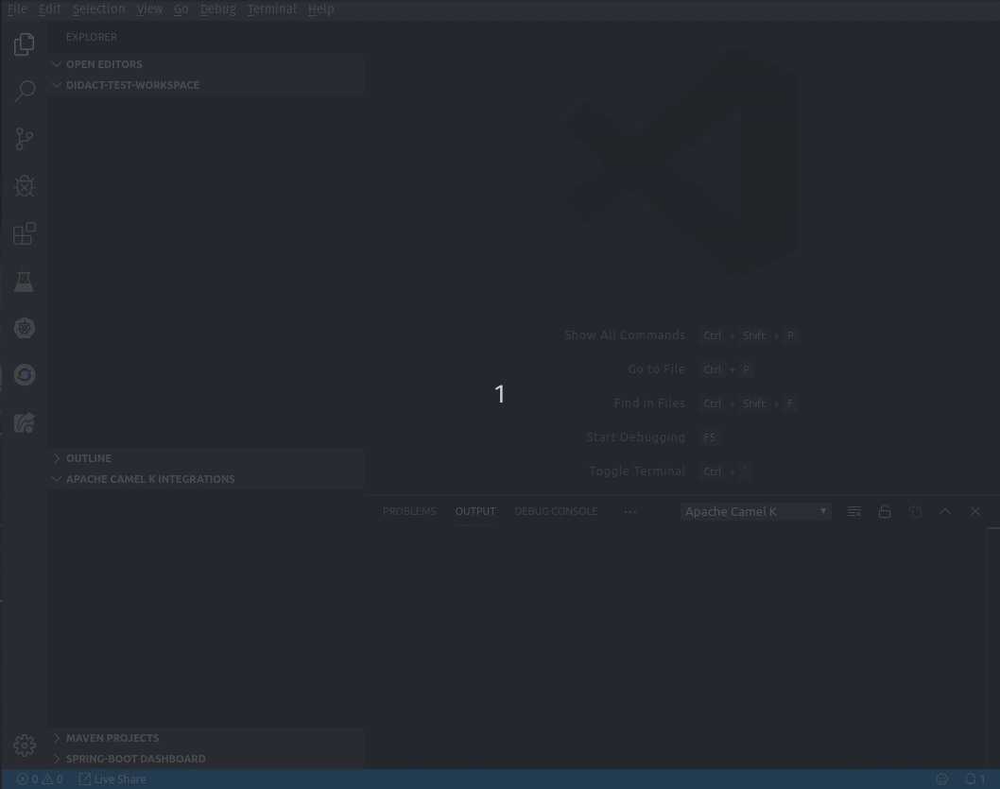

# vscode-didact README  

The *vscode-didact* extension prototype does a few things. Mainly it shows what's possible through a combination of a simple Markdown file, the VS Code Webview, and calling through to easily accessible commands.

## VSCode-Didact In Action

The *vscode-didact* extension prototype does a few things. Mainly it shows what's possible through a combination of a simple Markdown file, the VS Code Webview, and calling through to easily accessible commands.

What follows is a simple example with three actions. 

### Step 1

The first step scaffolds a project that looks like:

* root
  * resources
    * images
    * text
  * src
    * simple.groovy [from the Apache Camel K examples](https://github.com/apache/camel-k/blob/master/examples/simple.groovy)

This project is defined entirely through JSON, so we should be able to easily construct simple examples with text-based content files. Currently this is specified in code and referenced by the command *vscode.didact.scaffoldProject*, which is called.

### Step 2

The second step calls the *vscode.didact.tutorialStep* command, which essentially looks for a file in the path at root/src/simple.groovy and calls a standard VS Code command to open it -- *vscode.openFolder*. This opens the groovy file in an editor.

### Step 3

The third step calls into the Tooling for Apache Camel K extension and triggers the *camelk.startintegration* action and passes the path to the simple.groovy file in the generated project. We append the workspace root to the file and assume that it exists.

Note if the user clicks the steps out of order, it doesn't work. 

## Tutorial in Action

This simple tutorial is defined in [this MarkDown file](./src/tutorial2.md)

**Enjoy!**
