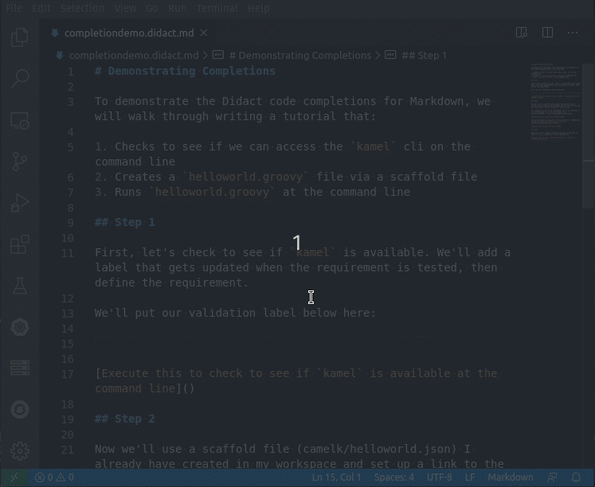

# Auto-complete for Didact in Markdown files

To help you set up Didact tutorials (`*.didact.md`, `*.didact.adoc`), we've added a number of auto-completions (accessible by pressing `Ctrl+Space` while editing an AsciiDoc or Markdown file) to provide most of the basic things you'll need.

Included completions:

* `didact` - inserts text for a sample Didact file
* `Insert Didact Badge` - adds a `Powered by Didact` image with a link back to the [github project](https://github.com/redhat-developer/vscode-didact)
* `Insert Didact Requirements label` - inserts a label that can be updated with Didact requirements testing commands
* `Insert link to install required VS Code extension` - inserts a quick link to install a particular VSCode extension (`vscode:extension/ExtensionPackID`)
* `Insert Validate All button` - adds an HTML button with a link to the Didact `validate all` command (`didact://?commandId=vscode.didact.validateAllRequirements`)
* From inside the link target (`[link text](link target)` for Markdown or `(link text)[link target]` for AsciiDoc), `Start a new didact link` inserts `didact://?` and then offers additional completions

From a `didact://?` start inside a Markdown or AsciiDoc link, you also get access to every command available in VS Code.
