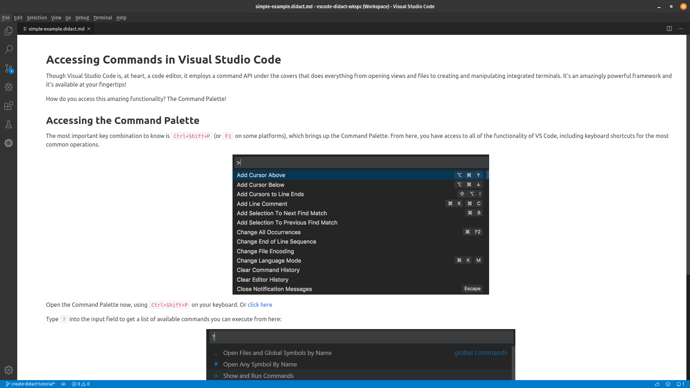
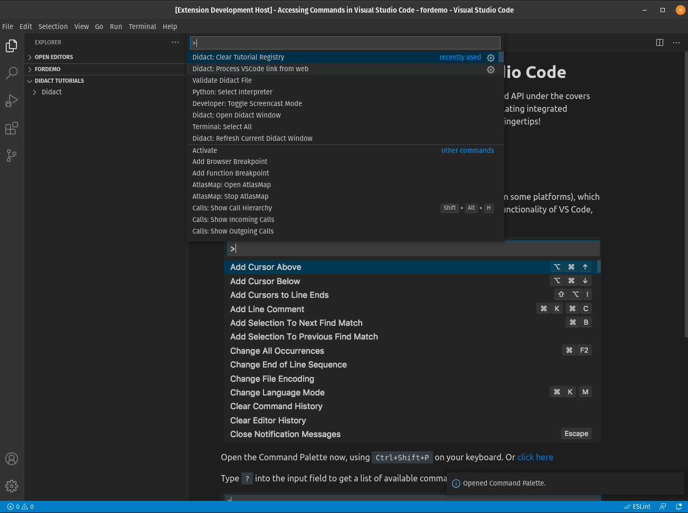

# How do you use Didact?

The goal for Didact is to combine simple markup and active links that take advantage of the command framework within VS Code. Essentially we want to employ the “Tell Them, Tell Them Again, and then Tell Them What You Told Them” approach, using a combination of text (or text and images) and actions. 

When a developer writes a VS Code extension, they are essentially creating commands and calling them via menus, buttons, and the command palette. And the API provides a great way to invoke those in other places too. That’s what we leverage in Didact.

## A Simple Example

Imagine that you are presented with this window in VS Code. 

This window tells us a few things… From inside of VS Code, not via an external web browser hosting the Getting Started Guide at the VS Code Documentation site (https://code.visualstudio.com/docs/getstarted/userinterface), you have access to:

* a bit of text that explains what the Command Palette is used for and how to access it
* and a simple link that opens the palette with a click, showing you what happens when you hit the right series of keys (Ctrl+Shift+P).

All the “heavy lifting” going on behind the scenes in that link is a simple URI…

* `didact://?commandId=workbench.action.showCommands&completion=Opened%20Command%20Palette`.

If we unpack that a little, we have a command ID to the showCommands command in VS Code, which is what gets triggered when you hit Ctrl+Shift+P on your keyboard, and a completion message that shows what Didact did under the covers in a small information popup in the lower right corner. 

So in this case, we told you what we were going to tell you, told you, showed it in action, and then showed it again, reinforcing the effects of clicking the right keys.
