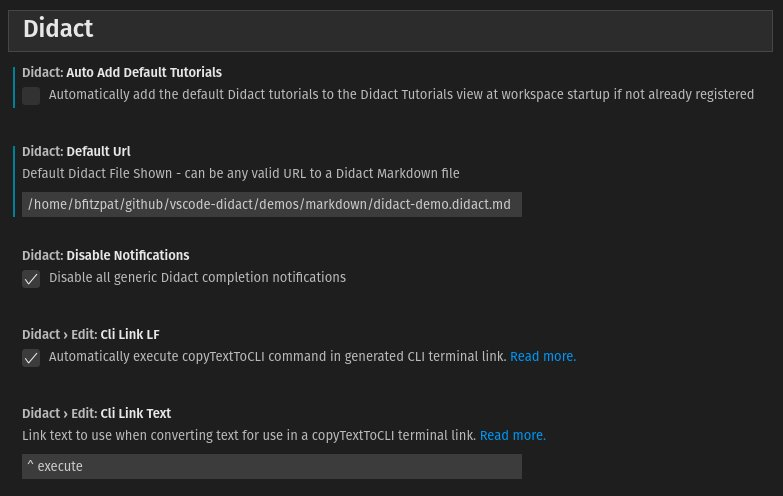

## Didact Settings 

The Didact Extension has several configurable settings available. To access the settings, go to (`File->Preferences->Settings`) and type **Didact**.

* To stop automatically recreating the default Didact Tutorials to the view at workspace startup (on by default), set the `Didact: Auto Add Default Tutorials` setting to unchecked.
* To change the default Didact file, set the `Didact: Default Url`. This can be any valid URL to a Didact formatted Markdown file, including `http://`, `https://`, or `file://` URLs.
* To turn on generic Didact completion notifications (off by default), set the `Didact: Disable Notifications` checkbox. If unchecked, additional notifications will occur when Didact actions are activated in the IDE.
* To have Didact open a window with the default Didact file on startup, set the `Didact: Open Default Tutorial At Startup` checkbox.

The `vscode.didact.copyTextToCLI` command (accessible via the default keyboard shorcut `Ctrl/Cmd+Alt+T`) has two customizations available:

* By default, the Didact link generated commits the change, executing it in the VS Code terminal. To simply add the text to the terminal without executing it, uncheck the `Didact>Edit:Cli Link LF` checkbox.
* By default, the Didact link generated uses the label `(^ Execute)`, but you can change that by updating the `Didact>Edit: Cli Link Text` field. Note that this field can also use Emojis, so you can use characters such as the `Play` button [(▶️)](https://emojipedia.org/play-button/).

