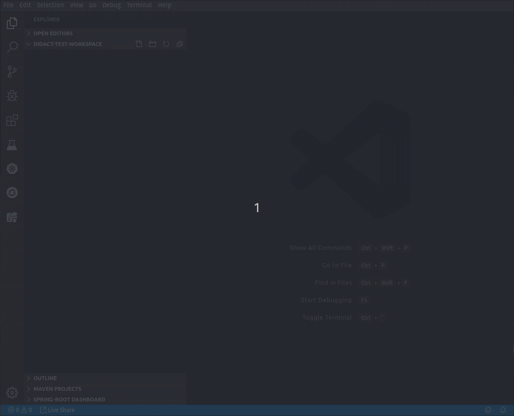

# Didact Tutorial Example

What follows is a simple example of the Didact approach. This tutorial is defined in simple Markdown format ([See the Markdown Guide for details](https://www.markdownguide.org/basic-syntax/)). These first two steps work out of the box using standard VS Code-provided commands.

The first step takes a simple JSON file and defines a folder structure in the user workspace with a single Apache Camel route defined in a Groovy file. The second step opens the Groovy file using the standard `vscode.openFolder` command in VS Code, pointing the command to at a workspace-relative path where the Groovy file exists in the user workspace.

As the user clicks each of these steps, they will see a little Information dialog appear in the lower right that gives them an indication that something has happened. If an error occurs, they will see an error in the same place with whatever error detail we can provide.

1. [Click here to create a new sample project](didact:commandId:vscode.didact.scaffoldProject:srcFilePath:example/project.json).
2. [Click here to open the simple.groovy file in the new sample project](didact:commandId:vscode.openFolder:projectFilePath:simpleGroovyProject/src/simple.groovy)

## This step requires a specific VS Code Extension already be installed

This particular step requires that the **Tooling for Apache Camel K** Extension be installed in the user's VS Code instance.

If the Camel K functionality is available, it calls the command `camelk.startintegration` and passes the file path as an argument so it triggers the same action as if you right-click on a Groovy file and select `Start Apache Camel K Integration`.

If the extension is not installed, it will show an error message to the user.

3. [Click here to start the simple.groovy file as a new Integration. Select *Dev Mode - Apache Camel K Integration in Dev Mode*](didact:commandId:camelk.startintegration:projectFilePath:simpleGroovyProject/src/simple.groovy)

## Tutorial in Action (Animated Gif)

